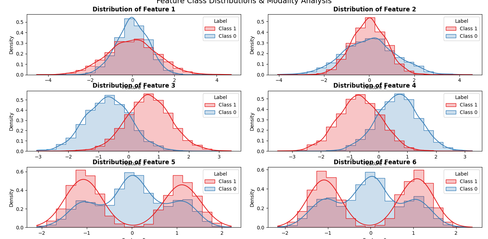

## Features Implemented

### 1. Principal Component Analysis (`pca.py`)
* **Data Centering:** Calculates dataset mean vector $\mu$ and centers the sample matrix $D_C = D - \mu$
* **Covariance Matrix:** Computes sample covariance matrix $C = \frac{1}{N} D_C D_C^T$
* **Eigendecomposition:** Solves for eigenvalues and eigenvectors using `numpy.linalg.eigh`
* **Dimensionality Reduction:** Reverses eigenvector order to select top $m$ principal components (highest variance) and projects data onto the reduced subspace
  $$DP = W_{\text{PCA}}^T \cdot D$$

### 2. Linear Discriminant Analysis (`lda.py`)
* **Class Scatter Matrices:**
  * **Within-Class Scatter Matrix ($S_W$):** Quantifies variance within each individual class.
  * **Between-Class Scatter Matrix ($S_B$):** Quantifies separation between different class means relative to the global mean.
* **Generalized Eigenvalue Problem:** Solves $S_B w = \lambda S_W w$ using `scipy.linalg.eigh(S_B, S_W)` to maximize class separability.
* **Direction Orientation Normalization:** Automatically checks orientation and flips transformation matrix $W$ to enforce consistent ordering of class means in projected space (ensuring Class 1 projected mean > Class 0 projected mean).
* **Linear Projection:** Projects features onto discriminant axes.

### 3. Classification & Evaluation Pipeline (`binary_classification_lda.py`)
* **Train/Validation Split:** Uses a 2:1 random split (`split_db_2to1`) to create training and validation sets to avoid evaluation bias.
* **Model Training & Projection:** Fits LDA transformation $W$ strictly on training data (`DTR`, `LTR`) and projects validation set (`DVAL`).
* **Threshold-Based Decision Rule:**
  * Calculates optimal threshold as the midpoint between projected training class means:
    $$\text{Threshold} = \frac{\mu_{0, \text{proj}} + \mu_{1, \text{proj}}}{2}$$
  * Predicts class labels for validation samples based on position relative to threshold:
    $$\hat{y} = \begin{cases} 1 & \text{if } D_{\text{VAL, proj}} \ge \text{Threshold} \\ 0 & \text{if } D_{\text{VAL, proj}} < \text{Threshold} \end{cases}$$
* **Evaluation & Metrics:** Calculates validation classification errors and prints original vs. predicted labels along with total misclassifications.
* **Visualization:** Plots sample distribution histograms for projected training and validation sets using `plot_simple_hist`.

---

##  Prerequisites & Installation

Ensure you have Python 3.8+ installed along with the required dependencies:

```bash
pip install numpy scipy matplotlib pandas
```

---

## How to Run

1. Place your dataset inside the `data/` folder (expected format: `data/trainData.txt`)[cite: 1].
2. Run the main evaluation script:

```bash
python binary_classification_lda.py
```

### Expected Output
Running `binary_classification_lda.py` will display logs similar to[cite: 1]:

```text
Threshold:  -0.0009467508236620237
Original Lables from validation: 

[1 0 0 ... 0 0 1]
Predicted Labels: 

[1 0 0 ... 0 0 1]
Total labels:  2000
Number of errors:  173
```

In addition, histogram plots comparing training set projection vs. validation set projection will be rendered to visually evaluate class separability. Here we have a 8.65% error rate, and this from the fact that LDA seeks for a linear separability, but if we see the features of our data this may not be possible in some cases.
For example we can see that features 3,4 may be linearly separable (but not at perfction though) while for features 5 and 6 this thing is impossible, with these features being multimodal, as it can be seen in the graph below. Simply using PCA as a preprocessing step and then LDA for classifying does not lead to a lot of improvement (having 176 errors in place of 178)



---

## 🔬 Mathematical Overview

| Algorithm | Objective | Key Equation |
| :--- | :--- | :--- |
| **PCA** | Maximize total variance | $C = \frac{1}{N} D_C D_C^T$ |
| **LDA** | Maximize between-class variance relative to within-class variance | $S_B w = \lambda S_W w$ |
```